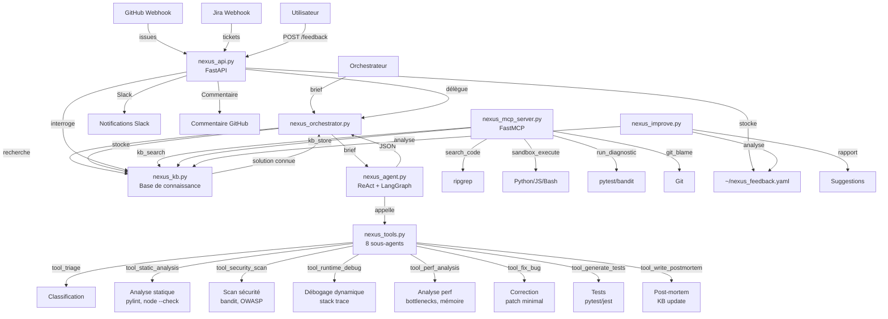

# Architecture Nexus-Debug v2

## Vue d'ensemble



## Flux de données

### 1. Réception du bug

```
Client → POST /debug → tasks_store{} → BackgroundTasks
                                         │
                                         ▼
                                 nexus_orchestrator.py
                                         │
                              ┌──────────┴──────────┐
                              ▼                     ▼
                      KB.search(brief)      nexus_agent.run(brief)
                      │                     │
                      │ match?              │ ReAct loop
                      │   oui: retour       │ Thought → Action →
                      │   direct            │ Observation → Repeat
                      └─────────────────────┘
                                         │
                                         ▼
                                    Résultat JSON
                                         │
                              ┌──────────┴──────────┐
                              ▼                     ▼
                        KB.store()           Rapport sauvegardé
                        (si fixed)           Notification Slack
                                             Commentaire GitHub
```

### 2. Boucle ReAct (nexus_agent.py)

```
État initial : {messages: [brief], mission_id, priority}
                    │
                    ▼
┌─── nexus_node() ──────────────────────┐
│   SystemMessage(NEXUS_SYSTEM_PROMPT)  │
│   + messages                          │
│   → LLM.invoke()                      │
│                                       │
│   Si tool_calls → next: "tools"       │
│   Si réponse finale → next: "end"     │
└──────────┬────────────────────────────┘
           │
    ┌──────┴──────┐
    ▼              ▼
"tools"         "end"
    │              │
ToolNode()     Final JSON
    │              │
    ▼              ▼
nexus_node()   Retour à Orchestrateur
```

### 3. Pipeline des 8 outils

```
                    tool_triage
                        │
                 ┌──────┴──────┐
                 │             │
        needs_security    needs_perf
                 │             │
         tool_security_scan   tool_perf_analysis
                 │             │
                 └──────┬──────┘
                        │
                 tool_static_analysis
                        │
                  tool_runtime_debug
                        │
                   tool_fix_bug
                        │
                 tool_generate_tests
                        │
                tool_write_postmortem
                        │
                   Résultat final
```

## Structure des fichiers

```
~/nexus-debug/
│
├── nexus_agent.py           ← LangGraph StateGraph + ReAct loop
├── nexus_tools.py           ← 8 @tool decorators + _call_subagent()
├── nexus_kb.py              ← YAML CRUD : store, search, stats
├── nexus_api.py             ← FastAPI 9 endpoints + webhooks + Slack
├── nexus_orchestrator.py    ← Pipeline orchestré avec KB check
├── nexus_mcp_server.py      ← FastMCP 7 outils
├── nexus_state.py           ← Pydantic BaseModel
├── nexus_improve.py         ← Analyse feedback + KB + suggestions
├── orchestrateur_integration.py   ← Interface delegate_task()
│
├── tests/
│   ├── test_kb.py           ← 5 tests KB
│   ├── test_tools.py        ← 4 tests outils
│   ├── test_api.py          ← 4 tests API
│   └── test_improve.py      ← 4 tests improve
│
├── docs/
│   ├── api.md               ← Documentation API
│   └── architecture.md      ← Ce fichier
│
├── README.md                ← Documentation complète
├── requirements.txt         ← Dépendances
├── SKILL.md                 ← Skill Hermes
├── .gitignore               ← Fichiers ignorés
└── schema_conceptuel.md     ← Comparaison pipeline vs agentique
```

## Dépendances

```
langgraph >= 0.2.0         ← Graphe d'état ReAct
langchain-openai >= 0.2.0  ← Client DeepSeek (OpenAI-compat)
openai >= 1.0.0            ← API OpenAI/DeepSeek
pydantic >= 2.0.0          ← Validation des données
fastapi >= 0.100.0         ← API REST
uvicorn >= 0.20.0          ← Serveur ASGI
pyyaml >= 6.0              ← Base de connaissance
httpx >= 0.24.0            ← Webhooks / Notifications
pytest >= 7.0              ← Tests
```

## Ports utilisés

| Service | Port | Description |
|---|---|---|
| API REST Nexus | **9001** | Endpoints debug, KB, webhooks |
| API Ahmada (existant) | 9000 | Ne pas confondre |
| Hermes Workspace | 5151 | Hermes Gateway |
| Hermes Dashboard | 9119 | Dashboard Hermes |

## Configuration

| Variable | Défaut | Description |
|---|---|---|
| `DEEPSEEK_API_KEY` | — | **Obligatoire** : clé DeepSeek |
| `NEXUS_MODEL` | `deepseek-chat` | Modèle DeepSeek |
| `NEXUS_API_PORT` | `9001` | Port API REST |
| `NEXUS_API_HOST` | `0.0.0.0` | Hôte API |
| `NEXUS_KB_PATH` | `~/nexus_kb.yaml` | Chemin KB |
| `NEXUS_REPORTS_DIR` | `~/nexus-reports` | Répertoire rapports |
| `NEXUS_FEEDBACK_PATH` | `~/nexus_feedback.yaml` | Fichier feedback |
| `GITHUB_WEBHOOK_SECRET` | — | Secret webhook GitHub |
| `GITHUB_TOKEN` | — | Token GitHub (commentaires) |
| `SLACK_WEBHOOK_URL` | — | URL webhook Slack |
